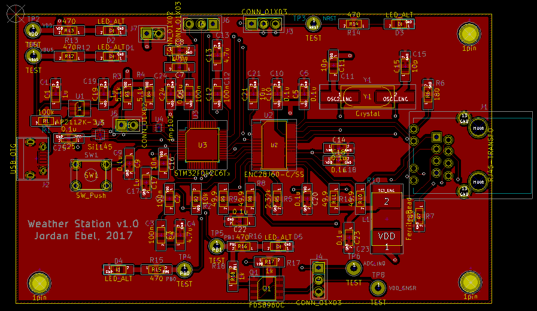

## Weather Station 
### Jordan Ebel

STM32F0 ARM Cortex M0 based weather station with temperature, UV, light, 
and soil moisture monitoring.  The board is powered with 5V from the USB 
connector.  The board includes a standard RJ-45 Ethernet jack with built-in
magnetics.  I2C, SWD, and some GPIO pins are broken out to connectors for
debug and test.

